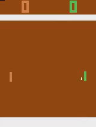

# Asynchronous-Advantage-Actor-Critic
Algorithm for learning how to perform tasks with only pixels and rewards as the agents understanding of the environment. The agent can learn how to play various atari games.

#####

I am currently cleaning up the code and training the model on other games. Once everything is production ready I will make a complete readme. For now, enjoy the gif!

